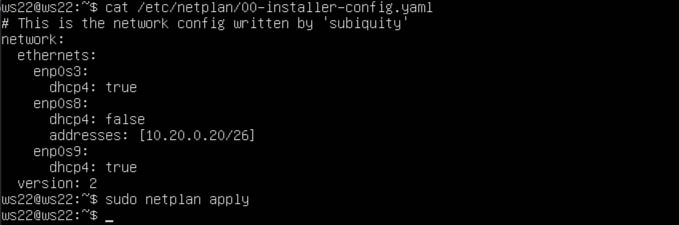
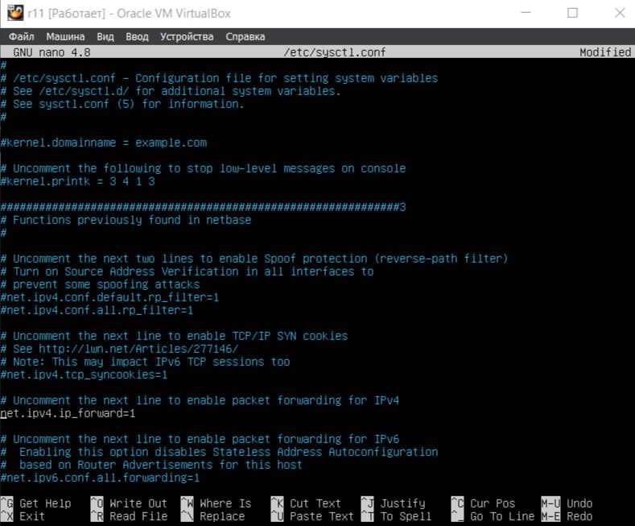
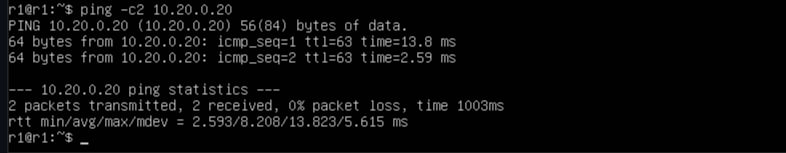

## Содержание ##
1. [Part 1. Инструмент ipcalc](#part-1-инструмент-ipcalc)
2. [Part 2. Статическая маршрутизация между двумя машинами](#part-2-cтатическая-маршрутизация-между-двумя-машинами)
3. [Part 3. Утилита iperf3](#part-3-утилита-iperf3)
4. [Part 4. Сетевой экран](#part-4-сетевой-экран)
5. [Part 5. Статическая маршрутизация сети](#part-5-статическая-маршрутизация-сети)
6. [Part 6. Динамическая настройка IP с помощью DHCP](#part-6-динамическая-настройка-ip-с-помощью-dhcp)
7. [Part 7. NAT](#part-7-nat)
8. [Part 8. Дополнительно. Знакомство с SSH Tunnels](#part-8-дополнительно-знакомство-с-ssh-tunnels)

## Part 1. Инструмент ipcalc ##
**Поднимаем виртуальную машину (далее -- ws1). Переименовываем с user-1 на ws1 с помощью команды `sudo hostnamectl set-hostname ws1`**

 *Рис.1 Переименование виртуальной машины* 

 

**1.1. Сети и маски**
**Для работы с инструментом ipclac устанавливаем его с помощью команды `sudo apt-get install ipcalc`**

**Адрес сети 192.167.38.54/13**

 *Рис.2 Адрес сети 192.167.38.54/13* 

 

**Перевод маски 255.255.255.0 в префиксную и двоичную запись, /15 в обычную и двоичную, 11111111.11111111.11111111.11110000 в обычную и префиксную**

**1.1. Переводим маску 255.255.255.0 в префиксную и двоичную запись**

* 255.255.255.0 - в префиксной записи 24
* 255.255.255.0 - в двоичной записи 11111111.11111111.11111111.00000000

 *Рис.3 Маска 255.255.255.0* 

 

**1.2. Переводим маску /15 в обычную и двоичную запись**

* /15 - в обычной записи 255.254.0.0
* /15 - в двоичной записи 11111111.11111110.00000000.00000000

 *Рис.4 Маска /15* 

 

**1.3. Переводим маску 11111111.11111111.11111111.11110000 в обычную и префиксную запись. В двоичном отображении маска подсети выглядит: 11111111.11111111.11111111.11110000 - содержит 28 единиц, что соответствует записи /28**

* 11111111.11111111.11111111.11110000 - в обычной записи 255.255.255.240
* 11111111.11111111.11111111.11110000 - в префиксной записи 28

 *Рис.5 Маска 11111111.11111111.11111111.11110000 (/28)* 

 

**Минимальный и максимальный хост в сети 12.167.38.4 при масках: /8, 11111111.11111111.00000000.00000000, 255.255.254.0 и /4**

**1.1. при маске /8**

* минимальный хост - 12.0.0.1
* максимальный хост - 12.255.255.254

 *Рис.6 Минимальный и максимальный хост при маске /8* 

 

**1.2. при 1111.11111111.00000000.00000000 (/16)**

* минимальный хост - 12.167.0.1
* максимальный хост - 12.167.255.254

 *Рис.7 Минимальный и максимальный хост при маске 11111111.11111111.00000000.00000000* 

 

**1.3. При 255.255.254.0**

* минимальный хост - 12.167.38.1
* максимальный хост - 12.167.39.254

 *Рис.8 Минимальный и максимальный хост при маске 255.255.254.0* 

 

**1.4. При /4**

* минимальный хост - 0.0.0.1
* максимальный хост - 15.255.255.254

 *Рис.9 Минимальный и максимальный хост при маске /4* 

 

**1.2. localhost**

**Определим, можно ли обратиться к приложению, работающему на localhost, со следующими IP: 194.34.23.100, 127.0.0.2, 127.1.0.1, 128.0.0.1**

* IP-адреса, начинающиеся с 127., зарезервированы для петлевых (loopback) интерфейсов. Это означает, что все адреса в диапазоне от 127.0.0.0 до 127.255.255.255 относятся к localhost и могут быть использованы для обращения к приложениям, работающим на вашем компьютере.
* Таким образом, можно обратиться к приложению с IP: 127.0.0.2, 127.1.0.1 Нельзя обратиться к приложению с IP: 194.34.23.100, 128.0.0.1

**1.3. Диапазоны и сегменты сетей**

**1. Определим, какие из перечисленных IP можно использовать в качестве публичного, а какие только в качестве частных: 10.0.0.45, 134.43.0.2, 192.168.4.2, 172.20.250.4, 172.0.2.1, 192.172.0.1, 172.68.0.2, 172.16.255.255, 10.10.10.10, 192.169.168.1**

* Для определения, какие IP-адреса могут быть использованы в качестве публичных, а какие в качестве частных, мы можем опираться на следующие диапазоны частных IP-адресов: 
    * 10.0.0.0 — 10.255.255.255 
    * 172.16.0.0 — 172.31.255.255 
    * 192.168.0.0 — 192.168.255.255 
* Адреса, попадающие в эти диапазоны, являются частными и используются в локальных сетях.  
* Частные IP-адреса: 
    * 10.0.0.45 
    * 192.168.4.2 
    * 172.20.250.4 
    * 172.16.255.255 
    * 10.10.10.10 
* Публичные IP-адреса: 
    * 134.43.0.2 
    * 172.0.2.1 
    * 192.172.0.1 
    * 172.68.0.2 
    * 192.169.168.1 

 

**2. Определим, какие из перечисленных IP адресов шлюза возможны у сети 10.10.0.0/18: 10.0.0.1, 10.10.0.2, 10.10.10.10, 10.10.100.1, 10.10.1.255**

* Расчет диапазона сети 10.10.0.0/18:  
    * IP-адрес сети: 10.10.0.0  
    * Маска сети: /18 (255.255.192.0)  
    * Диапазон IP-адресов: от 10.10.0.0 до 10.10.63.255  
* Могут быть адресами шлюза:  
    * 10.10.0.2  
    * 10.10.10.10  
    * 10.10.1.255  
* Не могут быть адресами шлюза:  
    * 10.0.0.1  
    * 10.10.100.1  

 

## Part 2. Статическая маршрутизация между двумя машинами ##

**1. Поднимаем две виртуальные машины (далее -- ws1 и ws2)**

**1.1. С помощью команды `ip a` смотрим существующие сетевые интерфейсы**

 *Рис.10 ws1* 

 

 *Рис.11 ws2* 

 

**2. Опишем сетевой интерфейс, соответствующий внутренней сети, на обеих машинах и зададим следующие адреса и маски: ws1 - 192.168.100.10, маска /16, ws2 - 172.24.116.8, маска /12** 

* Для работы с сетевым интерфейсом внутренней сети необходимо выключить виртуальную машину и перейти в раздел Settings->Network->Adapter  
* Далее включаем функцию "Enable Network Adapter". В разделе "Attached to" выбираем Internal Network. Name: intnet. 
**Описание: в каждой машине по 3 интерфейса:** 
* lo (local loopback), нужен для работы локальных сервисов и приложений по сетевым протоколамб всегда стандартный 
* enp0s3 - интерфейс адаптера, подключен к сети по протоколу dhcp в режиме NAT 
* enp0s8 - еще один интерфейс адаптера с заданным статическим адресом (без выхода в интернет) 

 *Рис.12 `ip a`* 

 

* Измененные файлы etc/netplan/00-installer-config.yaml для каждой машины

 *Рис.13 адреса и маски ws1 и ws2* 

 

**3. Выполним команду `netplan apply` для перезапуска сервиса сети.**

 *Рис.14 команда `netplan apply` и `ip a`* 

 

**2.1. Добавление статического маршрута вручную**

**Добавление статического маршрута от одной машины до другой и обратно при помощи команды вида `ip r add`**

**Добавим статический маршрут от одной машины до другой и обратно при помощи команды вида `ip r add`**

 *Рис.15 команда `ip r add`* 

 

**Пропингуем соединение между машинами**

 *Рис.16 пропингуем соединение между машинами* 

 

**2.2. Добавление статического маршрута с сохранением**

**Перезапустим машины**

* Используем команду `sudo reboot`

**Добавим статический маршрут от одной машины до другой с помощью файла /etc/netplan/00-installer-config.yaml**

 *Рис.17 добавим статический маршрут от одной машины до другой* 

 

**Пропингуем соединение между машинами**

 *Рис.18 пропингуем соединение между машинами* 

 

## Part 3. Утилита iperf3 ##

**3.1. Скорость соединения**

**Переведем: 8 Mbps в MB/s, 100 MB/s в Kbps, 1 Gbps в Mbps.**

* 8 Mbps = 1 MB/s  
* 100 MB/s = 8000 Kbps  
* 1 Gbps = 1000 Mbps  

 

**3.2. Утилита iperf3**

**Измерим скорость соединения между ws1 и ws2**

* ws1 выступает в роли сервера. Запуск iperf3 сервер, команда `iperf3 -s -f m`

 *Рис.19 запуск iperf3 сервер* 

 

* ws2 выступает в роли клиента. Запуск iperf3 клиент, команда `iperf3 -c 192.168.100.10`

 *Рис.20 запуск iperf3 клиент* 

 

## Part 4. Сетевой экран ##

**4.1. Утилита iptables**

**Создадим файл /etc/firewall.sh, имитирующий фаерволл, на ws1 и ws2**

* Нужно добавить в файл подряд следующие правила:

1) На ws1 применим стратегию, когда в начале пишется запрещающее правило, а в конце пишется разрешающее правило (это касается пунктов 4 и 5). 

2) На ws2 применим стратегию, когда в начале пишется разрешающее правило, а в конце пишется запрещающее правило (это касается пунктов 4 и 5). 

3) Откроем на машинах доступ для порта 22 (ssh) и порта 80 (http). 

4) Запретим echo reply (машина не должна «пинговаться», т.е. должна быть блокировка на OUTPUT). 

5) Разрешим echo reply (машина должна «пинговаться»). 

 

 *Рис.21 имитация сетевых экранов на виртуальных машинах ws1 и ws2* 

 

**Запустим файлы на обеих машинах командами `chmod +x /etc/firewall.sh` и `/etc/firewall.sh`**

 *Рис.22 запускаем файл на ws1* 

 

 *Рис.23 запускаем файл на ws2* 

 

* Разница между стратегиями в том, что в первом файле первым подходящим правилом для пакета является запрет, а во втором - разрешение. Применяется только первое подходящее правило, остальные игнорируются.

**4.2. Утилита nmap**

**Командой ping найдём машину, которая не «пингуется», после чего утилитой nmap покажим, что хост машины запущен**

 *Рис.24 пингуем ws1 с ws2* 

 

 *Рис.25 пингуем ws2 с ws1* 

 

 *Рис.26 запускаем с помощью команды `nmap 172.24.116.8`* 

 

* находим машину, которая не «пингуется», утилита nmap говорит о том что Host is up, значит хост машины запущен  

**Сохраняем дампы образов виртуальных машин**

## Part 5. Статическая маршрутизация сети ##

 

 

**Поднимем пять виртуальных машин (3 рабочие станции (ws11, ws21, ws22) и 2 роутера (r1, r2))**

**5.1. Настройка адресов машин**

**Настроим конфигурации машин в etc/netplan/00-installer-config.yaml согласно сети на рисунке**

 *Рис.27 ws11* 
 *Рис.28 ws21* 
 *Рис.29 ws22* 
 *Рис.30 r1* 
 *Рис.31 r2* 

 

**Перезапустим сервис сети. Если ошибок нет, то командой ip -4 a проверим, что адрес машины задан верно. Также пропингуем ws22 с ws21. Аналогично пропингуем r1 с ws11**

 *Рис.32 ws11* 
 *Рис.33 ws21* 
 *Рис.34 ws22* 
 *Рис.35 r1* 
 *Рис.36 r2* 

 

**Пропингуем ws22 с ws21:**

 *Рис.37 ws22 с ws21* 

 

**Пропингуем r1 с ws11:**

 *Рис.38 r1 с ws11* 

 

**5.2. Включение переадресации IP-адресов**

**Для включения переадресации IP, выполни команду на роутерах: `sysctl -w net.ipv4.ip_forward=1`*При таком подходе переадресация не будет работать после перезагрузки системы***

 *Рис.39 r1* 
 *Рис.40 r2* 

 

**Откроем файл /etc/sysctl.conf и добавим в него следующую строку: `net.ipv4.ip_forward = 1` *При использовании этого подхода, IP-переадресация включена на постоянной основе***

 *Рис.41 r1* 
 *Рис.42 r2* 

 

**5.3. Установка маршрута по-умолчанию**

**Добавим gateway4 [ip роутера] в файлы конфигураций рабочих станций, перезапустим сервис сети и вызовем команду ip r:**

 *Рис.43 ws11* 
 *Рис.44 ws21* 
 *Рис.45 ws22* 

 

**Пропингуем с ws11 роутер r2 и покажем на r2, что пинг доходит с помощью команды `tcpdump -tn -i eth1`:**

 *Рис.47 пропингуем с ws11 роутер r2* 

 

**5.4. Добавление статических маршрутов**

**Добавим в роутеры r1 и r2 статические маршруты в файле конфигураций, перезапустим сервис сети и вызовем команду ip r:**

 *Рис.48 r1* 
 *Рис.49 r2* 

 

**Вызов команд `ip r list 10.10.0.0/[маска сети]` и `ip r list 0.0.0.0/0` на ws11:**

 *Рис.50* 

 

* Для адреса 10.10.0.0/[маска сети] был выбран маршрут, отличный от 0.0.0.0/0, потому что маска /18 описывает маршрут к сети точнее, в отличие от маски /0. 

 

**5.5. Построение списка маршрутизаторов**

**Запуск на r1 команды дампа tcpdump -tnv -i ent0 и построение списка маршрутизаторов на пути от ws11 до ws21 при помощи утилиты traceroute:**

 *Рис.51 r1* 
 *Рис.52 r2* 

 

* С помощью утилиты traceroute я определила последовательность маршрутизаторов от VM PS-ws11 до VM PS-ws21. Команда traceroute отправляет UDP пакеты с постепенно увеличивающимся значением TTL (Time To Live). Сначала отправляется пакет с TTL, равным 1, и фиксируется адрес ответившего узла. Затем TTL увеличивается до 2, затем до 3, и так продолжается, пока пакет не достигнет конечной цели. Каждый раз отправляется по три пакета, и для каждого из них измеряется время прохождения. Пакеты отправляются на случайные порты, которые, скорее всего, не заняты. Когда утилита traceroute получает от целевого узла сообщение о недоступности порта, трассировка завершается.

 

**5.6. Использование протокола ICMP при маршрутизации**

**Запустим на r1 перехват сетевого трафика, проходящего через eth0 с помощью команды: `tcpdump -n -i eth0 icmp` и пропингуем с ws11 несуществующий IP (например, 10.30.0.111) с помощью команды: `ping -c 1 10.30.0.111`**

 *Рис.53 перехват сетевого трафика* 
 *Рис.54 пинг с ws11 несуществующий IP* 

 

## Part 6. Динамическая настройка IP с помощью DHCP ##

**Для r2 настроим в файле /etc/dhcp/dhcpd.conf конфигурацию службы DHCP:**

**1. Укажим адрес маршрутизатора по-умолчанию, DNS-сервер и адрес внутренней сети**

 *Рис.55 файл dhcpd.conf* 

 

**2. В файле resolv.conf пропиши nameserver 8.8.8.8**

 *Рис.56 файл resolv.conf* 

 

**Перезагрузим службу DHCP командой `systemctl restart isc-dhcp-server`. Машину ws21 перезагрузим при помощи `reboot` и через `ip a` покажим, что она получила адрес. Также пропингуем ws22 с ws21.**

 *Рис.57 перезагрузим службу DHCP* 

 

 *Рис.58 через `ip a` покажим, что ws21 получила адрес* 

 

 *Рис.59 пропингуем ws22 с ws21* 

 

**Укажeм MAC адрес у ws11, для этого в etc/netplan/00-installer-config.yaml надо добавить строки: macaddress: 10:10:10:10:10:BA, dhcp4: true.**

 *Рис.60 файл 00-installer-config.yaml* 

 

**Для r1 настроим аналогично r2, но сделаем выдачу адресов с жесткой привязкой к MAC-адресу (ws11)**

 *Рис.61 адрес маршрутизатора по-умолчанию, DNS-сервер и адрес внутренней сети* 

 

 *Рис.62 файл resolv.conf* 

 

 *Рис.63 перезагрузим службу DHCP* 

 

**Запросим с ws21 обновление ip адреса**

 *Рис.64 обновление ip адреса* 

 

 *Рис.65 обновление ip адреса* 

 

* Команда `sudo dhclient -r enp0s8` используется для освобождения IP-адреса, который был получен через DHCP для интерфейса enp0s8. В этой команде используется несколько опций DHCP клиента dhclient. Вот подробное объяснение: 

* sudo: Запуск команды с правами суперпользователя (root). 
* dhclient: DHCP клиент, который используется для получения и управления IP-адресами через протокол DHCP. 
* -r: Опция для освобождения (release) текущего IP-адреса, который был назначен интерфейсу enp0s8. 
* enp0s8: Имя сетевого интерфейса, для которого выполняется команда. 

 

## Part 7. NAT ##

**Установила утилиту веб-сервер Apache (`sudo apt install apache2`)**

**В файле /etc/apache2/ports.conf на ws22 и r1 изменим строку Listen 80 на Listen 0.0.0.0:80, то есть сделаем сервер Apache2 общедоступным**

 *Рис.66 файлы ports.conf на ws22 и r1* 

 

**Запустим веб-сервер Apache командой `service apache2 start` на ws22 и r1.**

 *Рис.67 веб-сервер Apache на ws22 и r1* 

 

**Добавим в фаервол, созданный по аналогии с фаерволом из Части 4, на r2 следующие правила:**

1) Удаление правил в таблице filter - iptables -F; 

2) Удаление правил в таблице "NAT" - iptables -F -t nat; 

3) Отбрасывать все маршрутизируемые пакеты - iptables --policy FORWARD DROP. 

 *Рис.68 добавим в фаервол правила* 

 

**Проверим соединение между ws22 и r1 командой ping**
*При запуске файла с этими правилами, ws22 не должна «пинговаться» с r1.*

 *Рис.69 r1* 
 *Рис.68 ws22* 

 

**Добавим в файл ещё одно правило:**

4) Разрешить маршрутизацию всех пакетов протокола ICMP. 

 *Рис.69 разрешить маршрутизацию всех пакетов протокола ICMP* 

 

* Запуcкаем файл также, как выше.

**Проверим соединение между ws22 и r1 командой ping.**
*При запуске файла с этими правилами, ws22 должна «пинговаться» с r1.*

 *Рис.70 r1* 
 *Рис.71 ws22* 

 

**Добавим в файл ещё два правила:**

5) Включиим SNAT, а именно маскирование всех локальных ip из локальной сети, находящейся за r2 (по обозначениям из Части 5 - сеть 10.20.0.0).

6) Включиим DNAT на 8080 порт машины r2 и добавить к веб-серверу Apache, запущенному на ws22, доступ извне сети.

 *Рис.72 добавим в фаервол правила* 

 

*На всех VM (Route r1, Route r2, ws11, ws21, ws22) отключил Адаптер на котором был подключен сетевой адаптер NAT* 

**Проверим соединение по TCP для SNAT: для этого с ws22 подключиться к серверу Apache на r1 командой: `telnet [адрес] [порт]`**

 *Рис.73 ws22* 

 

**Проверим соединение по TCP для DNAT: для этого с r1 подключиться к серверу Apache на ws22 командой telnet (обращаться по адресу r2 и порту 8080)**

 *Рис.74 r1* 

 

* Сохранила дампы образов виртуальных машин

## Part 8. Дополнительно. Знакомство с SSH Tunnels ##

**Запустим на r2 фаервол с правилами из Части 7**

 *Рис.75 фаервол* 

 

**Запустим веб-сервер Apache на ws22 только на localhost (то есть в файле /etc/apache2/ports.conf изменим строку Listen 80 на Listen localhost:80)**

 *Рис.76 файл ports.conf* 

 

**Воспользуемся Local TCP forwarding с ws21 до ws22, чтобы получить доступ к веб-серверу на ws22 с ws21.**

 *Рис.77 с помощью команды `ssh -L 8080:localhost:80 ws22@10.20.0.20`* 

 

**Проверка подключения:**

 *Рис.78 Проверка подключения* 

 

**Воспользуемся Remote TCP forwarding c ws11 до ws22, чтобы получить доступ к веб-серверу на ws22 с ws11**

 *Рис.79 с помощью команды `ssh -R 8080:localhost:80 10.20.0.20`* 

 

**Проверка подключения:**

 *Рис.80 Проверка подключения* 

 